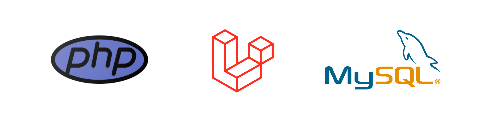
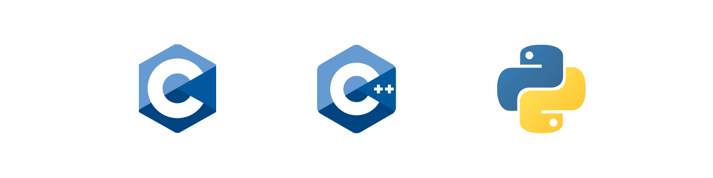
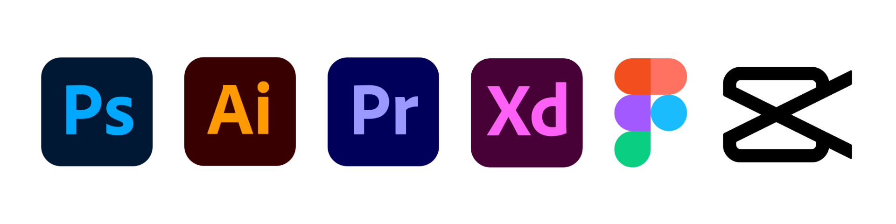

## Hi, I'm Abdelrahman Mustafa 👋

Backend-focused software engineering student based in Cairo, Egypt.

I've been fascinated by computer science and understanding how systems work since I was young. My goal is to become a software engineer with strong fundamentals and broad technical knowledge, not just a stack-specific developer.

Here on GitHub, I share:

* Projects and experiments
* Self-study notes
* Labs and learning resources
* Backend development practice

---

## Tech Stack

Currently focusing on backend development with:

  

I’m also comfortable working with:

  

In the future, I plan to explore:

* Embedded Systems
* Cybersecurity
* Infrastructure & DevOps
* Low-level computing concepts

---

## Creative Background

Before focusing mainly on software engineering, I spent a lot of time working with graphic design, UI/UX, and video editing. I’ve worked on several creative projects and currently freelance as a video editor for social media content.

Tools I can work with comfortably:

  

---

## Current Goal

Building strong engineering fundamentals while continuously documenting my learning journey and projects publicly on GitHub.
